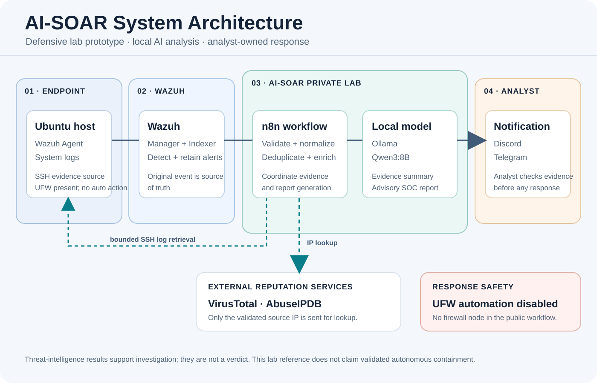
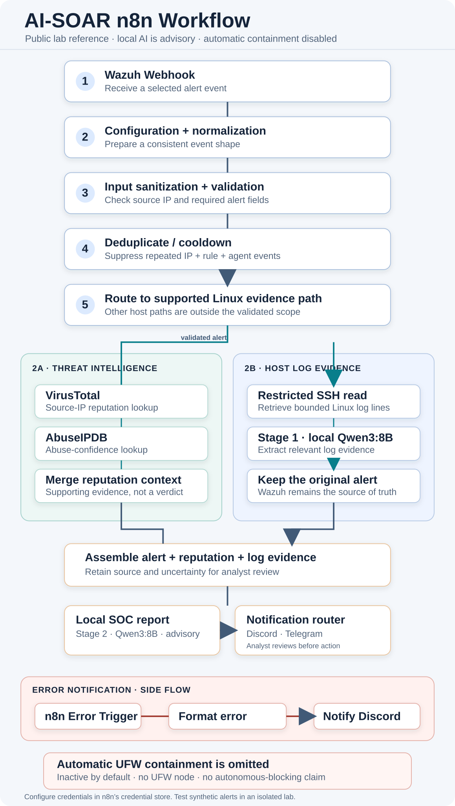

# AI SOC Analyst L1

An academic team capstone prototype for reducing repetitive SOC Level 1 alert-triage work with Wazuh, n8n, a local Qwen3:8B model served by Ollama, and IP reputation context from VirusTotal and AbuseIPDB.

This repository is a **sanitized lab reference**, not a production deployment. It contains an inactive n8n export with credentials and environment-specific notes removed. The export has no UFW execution node; automated containment is deliberately disabled because the source workflow’s response gate was not validated end to end.

## What it demonstrates

- Ingest and normalize Wazuh alerts through an n8n webhook.
- Validate indicators and suppress duplicate alerts before enrichment.
- Query VirusTotal and AbuseIPDB for a source IP (only the selected indicator leaves the lab).
- Collect bounded Linux endpoint context over SSH.
- Use local Qwen3:8B through Ollama for evidence extraction and an analyst-facing report.
- Route notifications to configured analyst channels and handle workflow errors.

Wazuh remains the source of detection evidence. Threat-intelligence results are supporting context. The model output is advisory and cannot authorize a response action.

## Architecture

See [the architecture and trust boundaries](docs/architecture.md), [the setup notes](docs/runbook.md), and [the safety review](docs/safety-review.md). The public project story is also available in the [portfolio article](https://khanchannn.github.io/dulkanggg/post/ai-soc-analyst-l1/).

*System architecture. Automated UFW containment is disabled in the public reference.*

*n8n workflow overview. The public export has no firewall execution node.*

## Quick start

1. Prepare an isolated lab with Wazuh, n8n, Ollama, and a monitored Ubuntu endpoint. Use the versions and addressing already approved for your lab; this repository intentionally does not prescribe credentials or expose a live topology.
2. Install the `qwen3:8b` model in Ollama and restrict the Ollama API to the lab network.
3. Import [`workflows/ai-soc-analyst-l1-redacted.json`](workflows/ai-soc-analyst-l1-redacted.json) into n8n. It is inactive by default.
4. Create credentials in n8n for SSH, VirusTotal, AbuseIPDB, and the notification provider you use. Configure the Telegram API URL with a credential-backed value if enabling that node; never paste a bot token into exported workflow code.
5. Configure the Wazuh alert webhook and n8n node credentials for your isolated environment. Test with synthetic events first and review n8n execution data for sensitive fields.
6. Keep the workflow inactive until every external dependency and failure branch has been checked. The export intentionally has no automatic firewall action.

There is no one-command deployment: Wazuh, n8n, Ollama, and the endpoint have separate installation and trust-boundary requirements. Follow their official documentation and adapt this reference to a lab you control.

## Validation status

The capstone documentation records functional integration of alert processing, local report generation, enrichment, notification, and a basic manually controlled UFW deny command. It also records that the end-to-end automated containment gate and its negative, failure, and rollback tests were incomplete. No production-readiness, performance, or autonomous-containment claim is made here. See [safety review](docs/safety-review.md).

## Project credit

This was developed as a collaborative university capstone. The public notes describe the system and the integration work without publishing the team’s thesis, student identifiers, contact details, or individual contribution records. The repository has no license because it derives from a group project; ask the relevant contributors before reusing project-authored material.
